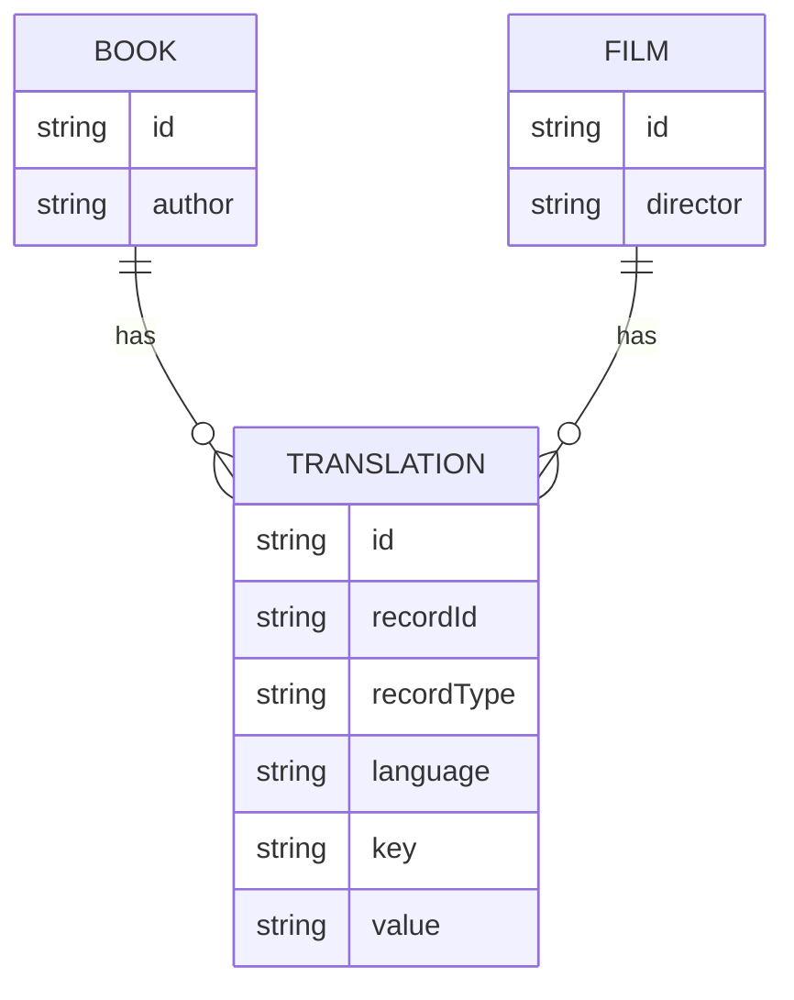

# Owning Team: @reliancehealthinc/nickmullen

Feel free to assign to a team!

# sample-ms

This sample microservice is intended for use as a template for node/typescript microservices. It demonstrates:

- a "good" structure that you can follow that seperates code into logical flows
  - routes
  - controllers
  - services
  - models
- interaction with databases
  - using Sequelize as an ORM
  - Polymorphic relationships between tables (a neat way of managing translations)
  - migrations and seeders
- testing
  - unit testing using JEST
  - load testing using K6
- instrumentation
  - using openTelemetry
- swagger
  - publishing documentation
- Docker
  - how to build and test locally
  - how to build a SMALL and efficient image that can be deployed to Production

## Overview

The service offers a demonstration of a very simple microservice.

The service in this case knows about Films and Books (we've actually only implemented Books, but Films is included in
the models to demonstrate how polymorphism works)

Books:

- Have an id
- Have an author
- Have names (which differ by language)
- Have descriptions (which differ by language)

Films:

- Have an id
- Have a director
- Have names (which differ by language)
- Have descriptions (which differ by language)

We will show how this can be done using 3 database tables:

- Books
- Films
- TranslatableItems

## Running locally

### Dependencies

- Node v22
- an instance of mySQL (the code is VERY easy to change to Postgres)
  - Later in the docker section, we can create a dockerised instance of mySQL for you to work with
- Rancher
  - so that you can test that your code works when dockerised (ie: it is ready to deploy somewhere)

### Initial setup

#### Fetch the code

```
git clone {the link to this repo}
cd sample-ms
npm install
```

#### Set environment variables

Create a file `.env` at the top level of the project. The code uses dotenv-safe which means your .env file MUST contain
ALL of the values that are included in `.env.example`

(once set we refer to the `CONFIG` object. See `/src/config/config.ts`) 

#### Configure the database

If you don't have one already, you can set up a local mysql db by running 
```
docker-compose up mysql
```
Which will run a dockerised mysql instance with a user and database already configured, but we still need to run migrations.

```
npm run prepareDB
```

which is equivalent to running:

```
npm run migrate:all
npm run seed:all
```

> **_REMEMBER:_**
>
> - MIGRATIONS are used to describe table structure ONLY (never content)
> - SEEDS are used to inject data ONLY (never structure)

What is happening under the hood when you run migration and seeds

- you are running sequelize-cli, NOT your main body of code
- sequlize-cli picks up config from the `.sequelizerc` file (and this in turn goes and has a look at `/src/config/sequelize.js`)

The `/src/config/sequelize.js` file has some interesting features:
- You can have a different config based on your `NODE_ENV`
- You can easily swap "dialect" to use a DB other than mySQL (although you had better have a ***very*** good reason for doing so)
- you can decide whether to store seed history
  - sequelize stores migration history in a table `SequelizeMeta` and this is NOT optional.  You must explicitly say whether you want to store seed history (we have) and it will get logged in a table `SequelizeData`.


#### Fire it up!

To start the service in development mode:
```
npm run dev
```
This will auto restart the code whenever you make changes.
Note there is a `.nodemon.json` file which has some interesting cofig in there.


#### (optional) Check on OpenTelemetry

OpenTelemetry is required on all of our projects, it's the main way of feeding data into NewRelic.
You can start a local, dockerised version of an OTEL collector by checking out https://github.com/reliancehealthinc/DEV-Open-Telemetry-Collector
You can then tail the logs to make sure when you make calls, that you see the events in the collector.

Open telemetry is provided by the file `/src/instrumentation.ts`.  You will notice in the `package.json` file that the script to run in production includes a reference to this file.  When running in dev mode, it's invoked slightly differently via the `nodemon.json` config.


## About "Polymorphism"
It's a fancy way of saying a foreign key relationship, but one that can point to muliple tables.
In this sample project we've two "parent" tables that both want to store "translatableItems" (names and descriptions). As we look in the `/src/models/book.ts` we see that 


The pseudo-foreign key relationship is tracked by recordId and recordType in the Translation table.
Looking into the book (and film) model, we can see that the relationship is defined there.